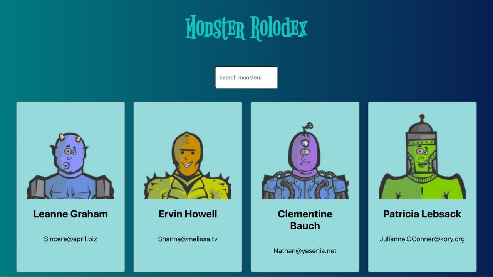

# Monster Rolodex

This is simple application made with purpose for training RestAPI

Check it online at: [Project Link](https://fernandosequineli.github.io/monsters-rolodex/)

## Tech Stack

**Client:** React, TailwindCSS

## Screenshots



## Run Locally

Clone the project

```bash
  git clone https://github.com/FernandoSequineli/monsters-rolodex
```

Go to the project directory

```bash
  cd my-project
```

Install dependencies

```bash
  npm install
```

Start the server

```bash
  npm run start
```
